# Azure Messaging Services: Complete Decision Guide

## Introduction

Azure provides three core messaging services for building scalable, event-driven, and reliable cloud solutions. Choosing the right service depends on your specific use case, message semantics, and architectural requirements. This guide provides a comprehensive framework for making informed decisions.

> **Key Distinction**: Understanding the difference between **events** and **messages** is fundamental to choosing the right Azure messaging service.

## Events vs Messages: The Critical Distinction

Before diving into the services, it's essential to understand the semantic difference between events and messages:

### Events Characteristics

| Aspect | Description | Example |
|--------|-------------|---------|
| **Nature** | Lightweight notification of a condition or state change | "File was created in blob storage" |
| **Publisher Expectation** | No expectation about how the event is handled | Fire and forget |
| **Data Content** | Information about what happened, not the data itself | Event contains file path, not file content |
| **Consumer** | Decides what to do with the notification | May ignore, log, or trigger workflow |

### Messages Characteristics

| Aspect | Description | Example |
|--------|-------------|---------|
| **Nature** | Raw data produced to be consumed or stored | Complete order details for processing |
| **Publisher Expectation** | Expects consumer to handle the message properly | Order must be processed, response expected |
| **Data Content** | Contains the actual data needed for processing | Full customer order with items, addresses |
| **Consumer** | Must process the message according to contract | Create order in system, return confirmation |

---

## The Three Azure Messaging Services

```mermaid
graph TB
    subgraph "Azure Messaging Services"
        SB[Azure Service Bus<br/>🏢 Enterprise Messaging]
        EG[Azure Event Grid<br/>⚡ Event Routing]
        EH[Azure Event Hubs<br/>📊 Big Data Streaming]
    end
    
    SB --> |"High-value<br/>commands & messages"| U1[Order Processing<br/>Financial Transactions]
    EG --> |"Discrete events<br/>state changes"| U2[Resource Notifications<br/>Serverless Triggers]
    EH --> |"Event streams<br/>telemetry"| U3[IoT Data<br/>Clickstream Analytics]
    
    style SB fill:#0078D4,color:#fff
    style EG fill:#7FBA00,color:#fff
    style EH fill:#FF8C00,color:#fff
```

### Quick Comparison Matrix

| Aspect | Azure Service Bus | Azure Event Grid | Azure Event Hubs |
|--------|-------------------|------------------|------------------|
| **Purpose** | Enterprise message broker | Event distribution | Big data streaming |
| **Message Type** | High-value messages/commands | Discrete events | Event streams (series) |
| **Pattern** | Queue & Pub/Sub | Pub/Sub only | Streaming |
| **Delivery Model** | Pull (consumer polls) | Push (to subscribers) | Pull (consumer controls) |
| **Delivery Guarantee** | At-least-once (exactly-once with sessions) | At-least-once | At-least-once |
| **Message Ordering** | FIFO with sessions | No guarantee | Per partition ordering |
| **Max Message Size** | 256 KB (Standard) / 100 MB (Premium) | 1 MB | 1 MB |
| **Retention** | Until consumed | 24 hours | 1-90 days (configurable) |
| **Typical Latency** | Milliseconds | Sub-second | Milliseconds |
| **Throughput** | Thousands/sec | 10M events/sec/region | Millions/sec |

---

## Azure Service Bus: Deep Dive

Azure Service Bus is a fully managed enterprise message broker designed for high-value, mission-critical messaging scenarios.

### Service Bus Architecture

### Key Features

| Feature | Description |
|---------|-------------|
| **Guaranteed Delivery** | Messages persist until acknowledged; peek-lock mechanism prevents loss |
| **FIFO Ordering** | First-in-first-out delivery using message sessions |
| **Dead Letter Queue** | Automatic handling of unprocessable messages |
| **Duplicate Detection** | Built-in detection prevents duplicate processing |
| **Transactions** | Atomic operations across multiple messages |
| **Sessions** | Group related messages for ordered processing |
| **Message Deferral** | Postpone message processing to a later time |
| **Scheduled Delivery** | Send messages to be delivered at a specific time |

### When to Use Service Bus

```mermaid
flowchart TD
    START[Do you need messaging?] --> Q1{Is it a high-value<br/>message that must<br/>be processed?}
    Q1 -->|Yes| Q2{Do you need<br/>guaranteed delivery?}
    Q1 -->|No| EG[Consider Event Grid]
    
    Q2 -->|Yes| Q3{Do you need<br/>message ordering<br/>or transactions?}
    Q2 -->|No| Q4{Is it for<br/>event streaming?}
    
    Q3 -->|Yes| SB[✅ Azure Service Bus]
    Q3 -->|No| Q5{Multiple consumers<br/>need the same message?}
    
    Q4 -->|Yes| EH[Consider Event Hubs]
    Q4 -->|No| SB
    
    Q5 -->|Yes, broadcast| SBTOPIC[Service Bus Topics]
    Q5 -->|No, single consumer| SBQUEUE[Service Bus Queues]
    
    style SB fill:#0078D4,color:#fff
    style SBTOPIC fill:#0078D4,color:#fff
    style SBQUEUE fill:#0078D4,color:#fff
    style EG fill:#7FBA00,color:#fff
    style EH fill:#FF8C00,color:#fff
```

**Use Service Bus when you need:**
- ✅ Guaranteed message delivery
- ✅ Message ordering (FIFO)
- ✅ Transaction support
- ✅ Duplicate detection
- ✅ Dead letter handling
- ✅ Long-running business processes
- ✅ Decoupling enterprise applications
- ✅ Load leveling for backend systems

---

## Service Bus: Queues vs Topics

One of the most common decisions when using Service Bus is choosing between **queues** and **topics**. This decision fundamentally affects your architecture.

### Conceptual Comparison

### Detailed Comparison: Queues vs Topics

| Aspect | Queues | Topics & Subscriptions |
|--------|--------|------------------------|
| **Communication Pattern** | Point-to-point | Publish/Subscribe (one-to-many) |
| **Message Delivery** | Single consumer receives each message | All subscriptions receive a copy |
| **Consumer Model** | Competing consumers share workload | Each subscription is independent |
| **Use Case** | Task distribution, command processing | Event broadcasting, notifications |
| **Filtering** | N/A (all messages go to queue) | Filter rules per subscription |
| **Scaling Receivers** | Add consumers to process faster | Add subscriptions for new scenarios |
| **Message Handling** | Message consumed = removed | Message copied to each subscription |

### Queue: Point-to-Point Communication

**Queue Use Cases:**
- Order processing (each order handled by one processor)
- Background job processing
- Load leveling between services
- Command execution (one executor per command)
- Work item distribution among workers

### Topics & Subscriptions: Publish/Subscribe

**Topics Use Cases:**
- Event broadcasting to multiple systems
- Notifications to multiple subscribers
- Event-driven architectures
- Audit logging (parallel to business processing)
- Multi-tenant message routing

### Decision Tree: Queue vs Topic

### Subscription Filters: Powerful Routing

Topics support subscription filters to route messages intelligently:

```mermaid
flowchart LR
    subgraph "Publisher"
        P[Order Service]
    end
    
    subgraph "Topic: order-events"
        T[Topic]
    end
    
    subgraph "Filtered Subscriptions"
        S1["📧 Email Notifications<br/>Filter: priority = 'high'"]
        S2["📱 Mobile Alerts<br/>Filter: amount > 1000"]
        S3["📊 Analytics<br/>Filter: TRUE (all messages)"]
        S4["🔍 Fraud Detection<br/>Filter: region = 'international'"]
    end
    
    P --> T
    T --> S1
    T --> S2
    T --> S3
    T --> S4
    
    style T fill:#50E6FF
    style S1 fill:#B4D8E7
    style S2 fill:#B4D8E7
    style S3 fill:#B4D8E7
    style S4 fill:#B4D8E7
```

**Filter Types:**
- **SQL Filters**: `priority = 'high' AND region = 'US'`
- **Correlation Filters**: Match on message properties
- **Boolean (True) Filter**: Default rule, matches all messages

---

## Azure Event Grid: Deep Dive

Azure Event Grid is a fully managed event routing service that enables event-driven architectures using a publish-subscribe model.

### Event Grid Architecture

### Key Features

| Feature | Description |
|---------|-------------|
| **Push Delivery** | Events pushed to subscribers immediately |
| **High Throughput** | 10,000,000 events per second per region |
| **Built-in Integration** | Native support for 20+ Azure services |
| **Custom Topics** | Publish your own application events |
| **Event Filtering** | Filter by event type, subject, or data |
| **Dead Lettering** | Capture undeliverable events |
| **Retry Policies** | Configurable retry with exponential backoff |
| **Low Cost** | First 100,000 operations free per month |

### When to Use Event Grid

**Use Event Grid when you need:**
- ✅ React to Azure resource changes (blob created, VM stopped)
- ✅ Serverless event-driven architectures
- ✅ High-throughput event distribution
- ✅ Fan-out to multiple handlers
- ✅ Near real-time event notification
- ✅ Simple event routing without complex messaging

---

## Azure Event Hubs: Deep Dive

Azure Event Hubs is a big data streaming platform designed for high-throughput event ingestion with low latency.

### Event Hubs Architecture

### Key Features

| Feature | Description |
|---------|-------------|
| **Massive Scale** | Millions of events per second |
| **Partitioning** | Parallel processing across partitions |
| **Consumer Groups** | Multiple independent readers |
| **Event Capture** | Automatic archival to storage |
| **Retention** | Configurable retention (1-90 days) |
| **Replay** | Read events from any point in stream |
| **Kafka Support** | Compatible with Apache Kafka clients |
| **Low Latency** | Sub-millisecond latency |

### When to Use Event Hubs

```mermaid
flowchart TD
    START[Do you need event streaming?] --> Q1{Is it telemetry,<br/>logs, or time-series data?}
    Q1 -->|Yes| Q2{Need to process<br/>millions of events/sec?}
    Q1 -->|No| Q3{Is it a discrete<br/>business event?}
    
    Q2 -->|Yes| EH1[✅ Event Hubs]
    Q2 -->|No| Q4{Need stream replay<br/>or historical analysis?}
    
    Q3 -->|Yes| EG[Consider Event Grid]
    Q3 -->|No, it's a command| SB[Consider Service Bus]
    
    Q4 -->|Yes| EH1
    Q4 -->|No| Q5{Using Apache Kafka?}
    
    Q5 -->|Yes| EH2[✅ Event Hubs<br/>with Kafka endpoint]
    Q5 -->|No| EG
    
    style EH1 fill:#FF8C00,color:#fff
    style EH2 fill:#FF8C00,color:#fff
    style EG fill:#7FBA00,color:#fff
    style SB fill:#0078D4,color:#fff
```

**Use Event Hubs when you need:**
- ✅ High-throughput event streaming
- ✅ IoT telemetry ingestion
- ✅ Clickstream analytics
- ✅ Log aggregation
- ✅ Event replay capability
- ✅ Apache Kafka compatibility
- ✅ Long-term event retention

---

## Complete Decision Framework

### Master Decision Flow

```mermaid
flowchart TD
    START[What type of<br/>communication do<br/>you need?] --> TYPE{Message Type?}
    
    TYPE -->|Command/Message<br/>Must be processed| CMD[Command Processing]
    TYPE -->|Event/Notification<br/>Something happened| EVT[Event Handling]
    TYPE -->|Stream/Telemetry<br/>Continuous data flow| STR[Stream Processing]
    
    CMD --> CMD1{Need guaranteed<br/>delivery & ordering?}
    CMD1 -->|Yes| SB[✅ Service Bus]
    CMD1 -->|No, simple queue| STORAGE[Consider Storage Queues]
    
    EVT --> EVT1{Reacting to<br/>Azure resources?}
    EVT1 -->|Yes| EG[✅ Event Grid]
    EVT1 -->|No| EVT2{Need complex<br/>routing rules?}
    
    EVT2 -->|Yes| SB
    EVT2 -->|No| EG
    
    STR --> STR1{Volume > 1M events/sec<br/>or need replay?}
    STR1 -->|Yes| EH[✅ Event Hubs]
    STR1 -->|No| STR2{Real-time analytics?}
    
    STR2 -->|Yes| EH
    STR2 -->|No| EG
    
    style SB fill:#0078D4,color:#fff
    style EG fill:#7FBA00,color:#fff
    style EH fill:#FF8C00,color:#fff
    style STORAGE fill:#808080,color:#fff
```

### Scenario-Based Guide

| Scenario | Recommended Service | Reason |
|----------|---------------------|--------|
| Order processing system | **Service Bus Queue** | Guaranteed delivery, ordering, transactions |
| Send notifications to multiple systems | **Service Bus Topic** | Fan-out with filtering per subscriber |
| React to blob storage changes | **Event Grid** | Native Azure integration, push model |
| Trigger Azure Functions on events | **Event Grid** | Serverless integration, low latency |
| IoT device telemetry ingestion | **Event Hubs** | Massive scale, partitioning, retention |
| Clickstream analytics | **Event Hubs** | Stream processing, replay capability |
| Financial transactions | **Service Bus** | FIFO, duplicate detection, transactions |
| Audit logging | **Service Bus Topic + Event Hubs** | Topic for real-time, Event Hubs for history |
| Microservice decoupling | **Service Bus** | Load leveling, guaranteed delivery |
| Real-time dashboards | **Event Hubs** | Multiple consumer groups, low latency |

---

## Combining Services: Crossover Patterns

In real-world architectures, services are often combined for optimal results.

### Pattern 1: Event Grid + Service Bus

**Use case**: Event Grid provides instant notification of blob creation, Service Bus ensures reliable processing with retry and dead-letter handling.

### Pattern 2: Event Hubs + Event Grid

**Use case**: Event Hubs handles the streaming ingestion, Event Grid triggers batch processing when capture files are created.

### Pattern 3: Service Bus + Event Grid (Idle Queue Optimization)

**Use case**: For queues with intermittent traffic, Event Grid eliminates wasteful polling by triggering consumers only when messages arrive.

---

## Best Practices Summary

### Service Bus Best Practices

1. **Use sessions for FIFO** when message ordering is required
2. **Enable duplicate detection** for idempotent processing
3. **Configure dead-letter queues** and monitor them
4. **Use batching** for high-throughput scenarios
5. **Choose Premium tier** for production workloads requiring isolation
6. **Use Topics** when multiple systems need the same event

### Event Grid Best Practices

1. **Use subject filtering** to reduce unnecessary invocations
2. **Implement dead-lettering** for critical events
3. **Use webhook validation** for custom endpoints
4. **Consider Event Grid domains** for multi-tenant scenarios
5. **Use CloudEvents schema** for interoperability

### Event Hubs Best Practices

1. **Choose partition count wisely** (cannot change after creation)
2. **Use partition keys** for related events ordering
3. **Implement checkpointing** for reliable processing
4. **Enable Capture** for long-term retention
5. **Use consumer groups** to separate processing concerns
6. **Consider Event Hubs Premium** for mission-critical workloads

---

## Summary Comparison Diagram

---

## References and Resources

### Official Microsoft Documentation

1. **Choose between Azure messaging services**  
   [https://learn.microsoft.com/en-us/azure/service-bus-messaging/compare-messaging-services](https://learn.microsoft.com/en-us/azure/service-bus-messaging/compare-messaging-services)

2. **Asynchronous messaging options in Azure**  
   [https://learn.microsoft.com/en-us/azure/architecture/guide/technology-choices/messaging](https://learn.microsoft.com/en-us/azure/architecture/guide/technology-choices/messaging)

3. **What is Azure Service Bus?**  
   [https://learn.microsoft.com/en-us/azure/service-bus-messaging/service-bus-messaging-overview](https://learn.microsoft.com/en-us/azure/service-bus-messaging/service-bus-messaging-overview)

4. **Service Bus queues, topics, and subscriptions**  
   [https://learn.microsoft.com/en-us/azure/service-bus-messaging/service-bus-queues-topics-subscriptions](https://learn.microsoft.com/en-us/azure/service-bus-messaging/service-bus-queues-topics-subscriptions)

5. **Azure Event Grid overview**  
   [https://learn.microsoft.com/en-us/azure/event-grid/overview](https://learn.microsoft.com/en-us/azure/event-grid/overview)

6. **Azure Event Hubs overview**  
   [https://learn.microsoft.com/en-us/azure/event-hubs/event-hubs-about](https://learn.microsoft.com/en-us/azure/event-hubs/event-hubs-about)

7. **Topic filters and actions**  
   [https://learn.microsoft.com/en-us/azure/service-bus-messaging/topic-filters](https://learn.microsoft.com/en-us/azure/service-bus-messaging/topic-filters)

8. **Storage queues and Service Bus queues - compared and contrasted**  
   [https://learn.microsoft.com/en-us/azure/service-bus-messaging/service-bus-azure-and-service-bus-queues-compared-contrasted](https://learn.microsoft.com/en-us/azure/service-bus-messaging/service-bus-azure-and-service-bus-queues-compared-contrasted)

### Architecture Patterns

9. **Publisher-Subscriber pattern**  
   [https://learn.microsoft.com/en-us/azure/architecture/patterns/publisher-subscriber](https://learn.microsoft.com/en-us/azure/architecture/patterns/publisher-subscriber)

10. **Competing Consumers pattern**  
    [https://learn.microsoft.com/en-us/azure/architecture/patterns/competing-consumers](https://learn.microsoft.com/en-us/azure/architecture/patterns/competing-consumers)

11. **Queue-based Load Leveling pattern**  
    [https://learn.microsoft.com/en-us/azure/architecture/patterns/queue-based-load-leveling](https://learn.microsoft.com/en-us/azure/architecture/patterns/queue-based-load-leveling)

12. **Priority Queue pattern**  
    [https://learn.microsoft.com/en-us/azure/architecture/patterns/priority-queue](https://learn.microsoft.com/en-us/azure/architecture/patterns/priority-queue)

### Related Blog Posts

13. **Events, Data Points, and Messages - Choosing the right Azure messaging service for your data**  
    [https://azure.microsoft.com/blog/events-data-points-and-messages-choosing-the-right-azure-messaging-service-for-your-data/](https://azure.microsoft.com/blog/events-data-points-and-messages-choosing-the-right-azure-messaging-service-for-your-data/)