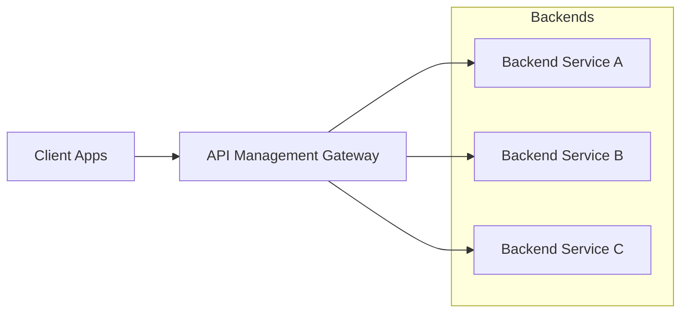
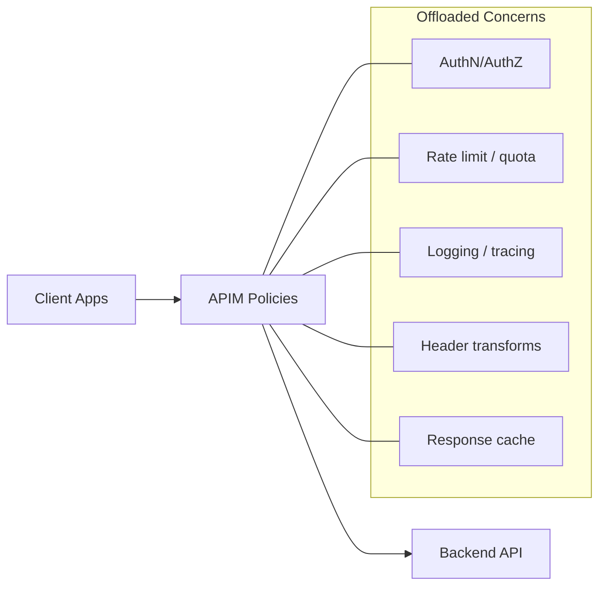

# Gateway Patterns with Azure API Management (APIM)

Azure API Management (APIM) is commonly used as the **gateway layer** in integration architectures. Microsoft’s cloud design patterns describe three gateway-centric patterns that map cleanly to APIM:

- **Gateway Routing**: one endpoint, many backends
- **Gateway Offloading**: centralize cross-cutting concerns
- **Gateway Aggregation**: reduce client chattiness

This guide explains *when* each pattern fits, *how* it maps to APIM, and what to watch out for in real integration workloads.

---

## Pattern: Gateway Routing

### What problem it solves
Clients shouldn’t need to know (or change) when:
- you add/remove backend services,
- you deploy multiple instances/regions,
- you roll out versions (blue/green or canary).

### APIM mapping
In APIM, routing is primarily a combination of:
- **APIs and operations** (front-door surface area)
- **Backends** and the `set-backend-service` / `forward-request` policies (where APIM sends traffic)
- **Versioning and revisions** (how you publish changes)

### Typical topology


### Common routing strategies (workshop talking points)
- **Route by path**: `/orders/*` → Orders service, `/catalog/*` → Catalog service.
- **Route by version**: `/v1/*` vs `/v2/*` (or APIM API versioning).
- **Route by environment**: sandbox vs prod via separate APIM instances, or via backends/policies.

### Key considerations
- Make the gateway **highly available** (avoid creating a single point of failure).
- Validate that routing rules don’t become a **bottleneck** under load.
- Prefer *backend isolation* (private endpoints/VNet) so backends are reachable only through the gateway.

---

## Pattern: Gateway Offloading

### What problem it solves
Cross-cutting concerns (security, throttling, caching, logging, protocol mediation) are hard to implement consistently in every service.

### APIM mapping
APIM is designed to offload these concerns using **policies** (applied globally, by product, API, or operation).

Typical offloaded capabilities in integration solutions:
- **Authentication / authorization**: validate JWT (Microsoft Entra ID tokens), client certificates
- **Input validation**: header checks, schema validation (where appropriate)
- **Threat reduction & abuse prevention**: rate limits, quotas, IP filtering
- **Observability hooks**: correlation IDs, request/response tracing to Azure Monitor / Application Insights (via APIM diagnostics)
- **Performance**: response caching

### Typical topology


### Key considerations
- Do **not** offload business logic to APIM. Keep it to gateway concerns.
- Offloading is powerful, but policy sprawl is real: standardize policy fragments and keep them version-controlled.

---

## Pattern: Gateway Aggregation

### What problem it solves
Some client screens/operations need data from multiple services. Calling each service separately increases latency and failure surface.

### Guidance for APIM-based implementations
Gateway aggregation can be implemented in a few ways:

1. **Recommended for most enterprises**: APIM + a dedicated aggregation service (often an Azure Function)
   - APIM handles gateway concerns
   - Aggregation service contains aggregation/business logic

2. **Possible but use sparingly**: APIM policies calling multiple backends (for lightweight composition)
   - Useful for small “glue” scenarios
   - Be careful: complex aggregation increases coupling and risks turning the gateway into a bottleneck

### Typical topology (APIM + aggregation service)
```mermaid
flowchart LR
  C[Client] --> APIM[API Management]
  APIM --> AGG[Aggregation API\n(Azure Function / App Service)]
  AGG --> S1[Service A]
  AGG --> S2[Service B]
  AGG --> S3[Service C]
```

### Key considerations
- Aggregation introduces a new component: treat it as a **critical dependency** (timeouts, retries, observability).
- Consider partial response behavior and caching strategies.
- Avoid tight coupling between backend services through the aggregator.

---

## Implementation checklist (L200–L300)

- **Routing**
  - Decide your routing dimension: path, version, client type, environment.
  - Ensure backends are network-isolated from the internet where possible.

- **Offloading**
  - Centralize identity enforcement (token validation).
  - Add rate limiting and quotas appropriate to consumer type (internal vs partner vs public).
  - Add correlation IDs and consistent logging.

- **Aggregation**
  - Use a dedicated aggregation service if aggregation needs business logic.
  - Keep APIM policies simple (avoid complex orchestration).

---

## References

- Cloud design patterns catalog: https://learn.microsoft.com/en-us/azure/architecture/patterns/
- Gateway Routing pattern: https://learn.microsoft.com/en-us/azure/architecture/patterns/gateway-routing
- Gateway Offloading pattern: https://learn.microsoft.com/en-us/azure/architecture/patterns/gateway-offloading
- Gateway Aggregation pattern: https://learn.microsoft.com/en-us/azure/architecture/patterns/gateway-aggregation
- Use API gateways in microservices (Azure Architecture Center): https://learn.microsoft.com/en-us/azure/architecture/microservices/design/gateway
- API Management policy reference: https://learn.microsoft.com/en-us/azure/api-management/api-management-policies
