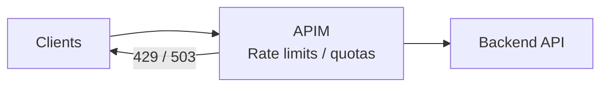

# Rate Limiting and Throttling with APIM

Rate controls are foundational for integration platforms:
- to protect backends from spikes and abuse,
- to create predictable throughput for consumers,
- to preserve reliability during bursts.

Microsoft’s cloud design patterns distinguish between:
- **Throttling** (the service *rejects/limits* callers to protect itself), and
- **Rate limiting** (the *client-side or intermediary* intentionally meters calls to avoid throttling and manage capacity).

APIM can implement both behaviors at the gateway boundary.

---

## Pattern: Throttling

### What it solves
When load exceeds available capacity, a platform must protect itself to keep meeting SLAs.

### How it shows up in API platforms
- returning **HTTP 429** (Too Many Requests) and/or **HTTP 503** (Server Too Busy)
- enforcing per-tenant or per-subscription limits
- disabling or degrading non-critical functionality during spikes

### APIM implementation
APIM supports throttling-like controls via policies such as:
- `rate-limit` (per subscription)
- `rate-limit-by-key` (per calculated key)
- `quota` / `quota-by-key`
- `limit-concurrency`

These controls let APIM actively reject or delay traffic *before* it reaches backends.

---

## Pattern: Rate Limiting

### What it solves
Rate limiting is used to reduce throttling errors and improve end-to-end throughput when downstream dependencies have strict limits.

### Common integration interpretation
- You might accept requests quickly at the API edge.
- Then you smooth processing to match a downstream system’s capacity.

Important nuance for integration architectures:
- **APIM is great at enforcing limits at the edge**.
- **If you need durable buffering/backpressure**, combine APIM with a queue/event stream (for example, Service Bus/Event Hubs) and process asynchronously.

---

## Recommended APIM policy building blocks

### 1) Simple per-subscription throttling
Use the “Limit call rate by subscription” policy to prevent spikes.

Example (illustrative):
```xml
<policies>
  <inbound>
    <base />
    <rate-limit calls="100" renewal-period="60" />
  </inbound>
  <backend>
    <base />
  </backend>
  <outbound>
    <base />
  </outbound>
  <on-error>
    <base />
  </on-error>
</policies>
```

### 2) Per-key throttling (tenant/user/API key)
Use a calculated key when you need rate limits that don’t map 1:1 to APIM subscriptions.

### 3) Quotas for cost governance
Quotas are useful for partner onboarding and monetization controls.

### 4) Concurrency limits
Concurrency is a different axis than “requests per minute.” It can be critical when backends are sensitive to parallelism.

---

## Designing a complete rate control strategy (L200–L300)

### Decide what you’re protecting
- Backend API compute (CPU, DB connections)
- Third-party SaaS call limits
- Shared integration runtime limits

### Choose the enforcement scope
- **Product scope**: consistent policy for a consumer group (internal vs partner vs public).
- **API scope**: consistent policy for a domain.
- **Operation scope**: stricter policy for expensive operations.

### Handle client behavior explicitly
When you reject requests, guide clients:
- Prefer returning 429 and supporting **Retry-After** semantics where possible.
- Document retry guidance in the developer portal.

### Watch-outs
- Throttling is not a substitute for capacity planning.
- If you throttle too aggressively, clients will retry in bursts and make things worse unless retry behavior is controlled.

---

## Simple reference diagram



---

## References

- Throttling pattern: https://learn.microsoft.com/en-us/azure/architecture/patterns/throttling
- Rate Limiting pattern: https://learn.microsoft.com/en-us/azure/architecture/patterns/rate-limiting-pattern
- Cloud design patterns catalog: https://learn.microsoft.com/en-us/azure/architecture/patterns/
- API Management policy reference: https://learn.microsoft.com/en-us/azure/api-management/api-management-policies
- Limit call rate by subscription (policy): https://learn.microsoft.com/en-us/azure/api-management/rate-limit-policy
- Limit call rate by key (policy): https://learn.microsoft.com/en-us/azure/api-management/rate-limit-by-key-policy
- Limit concurrency (policy): https://learn.microsoft.com/en-us/azure/api-management/limit-concurrency-policy
