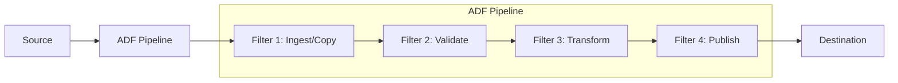

# Pipes and Filters with Azure Data Factory

The **Pipes and Filters** pattern breaks processing into discrete steps (filters) connected by a pipeline (pipes). In data integration, each transformation/activity is a filter, and orchestration is the pipe.

Azure Data Factory (ADF) pipelines align well with this model:
- each activity performs a specific task (copy, transform, validate),
- the pipeline defines sequencing, branching, and dependencies.

---

## Reference architecture

---

## Key considerations (L200–L300)

- **Small, composable steps**: keep each activity focused and reusable.
- **Contracts between stages**: define file/table schemas and naming conventions.
- **Failure isolation**: decide what should retry vs what should fail fast and alert.
- **Idempotency**: design pipeline steps so re-runs don’t corrupt results.

---

## References

- Pipes and Filters pattern: https://learn.microsoft.com/en-us/azure/architecture/patterns/pipes-and-filters
- Cloud design patterns catalog: https://learn.microsoft.com/en-us/azure/architecture/patterns/
- Azure Data Factory documentation: https://learn.microsoft.com/en-us/azure/data-factory/
