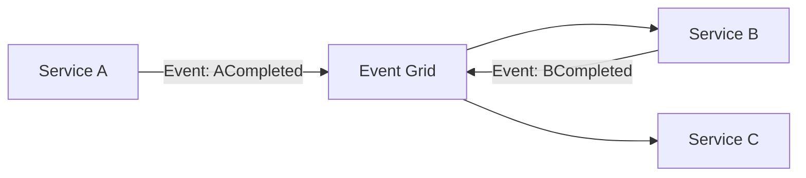

# Choreography with Azure Event Grid

The **Choreography** pattern coordinates a workflow through events rather than a central orchestrator. Each participant reacts to events and emits new events.

Azure Event Grid often acts as the event router in a choreography-based integration.

---

## When to use

Use choreography when:
- you want loose coupling across services,
- steps can be handled independently,
- you can model the process as a sequence of events.

Avoid it when:
- you require a single place to own the end-to-end flow and error handling (orchestration may be better).

---

## Reference flow

---

## Key considerations (L200–L300)

- **Observability**: distributed flows are harder to trace; use correlation IDs in events.
- **Failure handling**: decide how to handle partial completion (often needs compensating actions).
- **Ownership**: each component owns its reaction logic; avoid hidden coupling via undocumented events.

---

## References

- Choreography pattern: https://learn.microsoft.com/en-us/azure/architecture/patterns/choreography
- Cloud design patterns catalog: https://learn.microsoft.com/en-us/azure/architecture/patterns/
- Azure Event Grid documentation: https://learn.microsoft.com/en-us/azure/event-grid/
