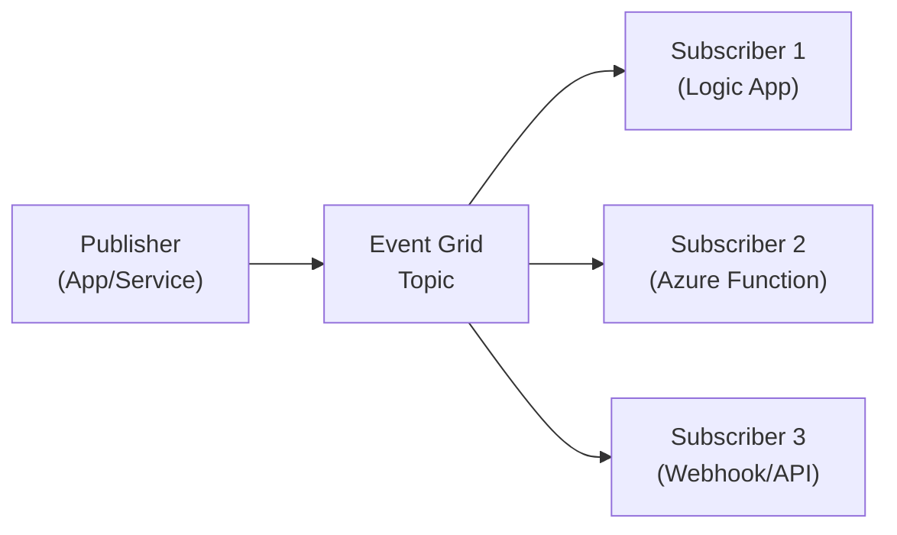

# Publisher/Subscriber (Pub/Sub) with Azure Event Grid

The **Publisher/Subscriber** pattern decouples event producers from event consumers. Producers emit events without knowing who receives them; subscribers independently react.

Azure Event Grid is purpose-built for event routing in Azure, making it a common backbone for integration and automation scenarios.

---

## When to use

Use Pub/Sub when:
- multiple downstream systems need to react to the same business event,
- you want to add/remove subscribers without changing the producer,
- you want near-real-time integration.

Avoid it when:
- you need strict point-to-point command processing (a queue may be better).

---

## Reference architecture

---

## Key considerations (L200–L300)

- **Event contract versioning**: evolve event schemas safely.
- **Idempotency**: subscribers should tolerate duplicate deliveries.
- **Error handling**: define what happens when a subscriber can’t process an event.
- **Event vs command**: publish facts (“OrderCreated”), not instructions (“CreateOrder”).

---

## References

- Publisher/Subscriber pattern: https://learn.microsoft.com/en-us/azure/architecture/patterns/publisher-subscriber
- Cloud design patterns catalog: https://learn.microsoft.com/en-us/azure/architecture/patterns/
- Azure Event Grid documentation: https://learn.microsoft.com/en-us/azure/event-grid/
