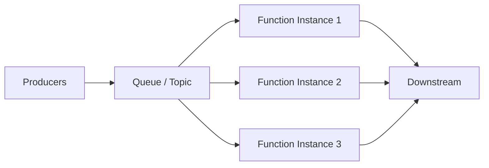

# Queue Consumers with Azure Functions

Azure Functions is commonly used to implement **elastic consumers** that process messages from queues/topics. This maps directly to cloud design patterns such as:
- **Competing Consumers** (parallelism for throughput)
- **Queue-Based Load Leveling** (buffer spikes and smooth processing)

---

## Reference architecture

---

## Practical guidance (L200–L300)

- **Scale**: use multiple instances to increase throughput; tune concurrency carefully to protect downstream systems.
- **Idempotency**: design handlers for at-least-once delivery.
- **Retries and poison messages**: define a strategy (retry with backoff, then dead-letter/quarantine).
- **Poison isolation**: route failures to a dead-letter queue and alert.

---

## References

- Competing Consumers pattern: https://learn.microsoft.com/en-us/azure/architecture/patterns/competing-consumers
- Queue-Based Load Leveling pattern: https://learn.microsoft.com/en-us/azure/architecture/patterns/queue-based-load-leveling
- Cloud design patterns catalog: https://learn.microsoft.com/en-us/azure/architecture/patterns/
- Azure Functions documentation: https://learn.microsoft.com/en-us/azure/azure-functions/
