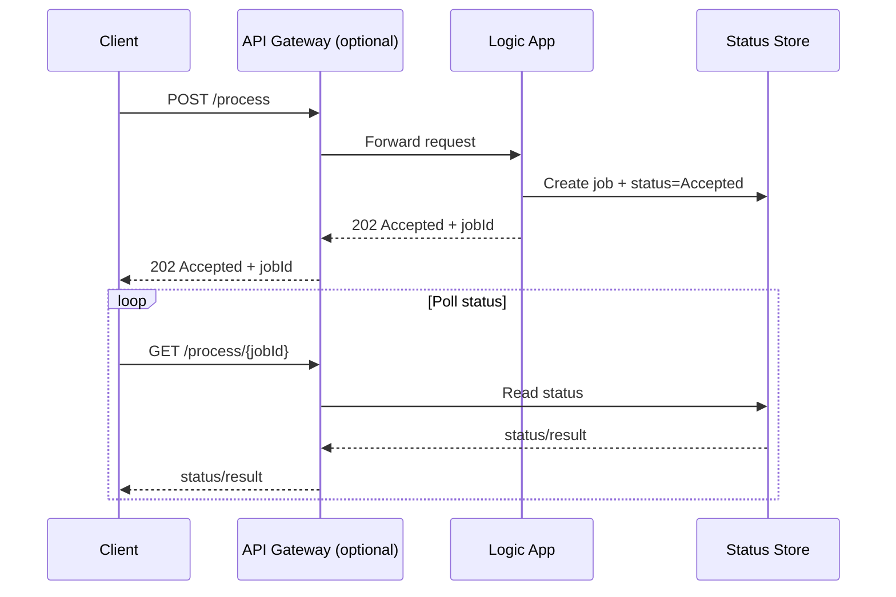
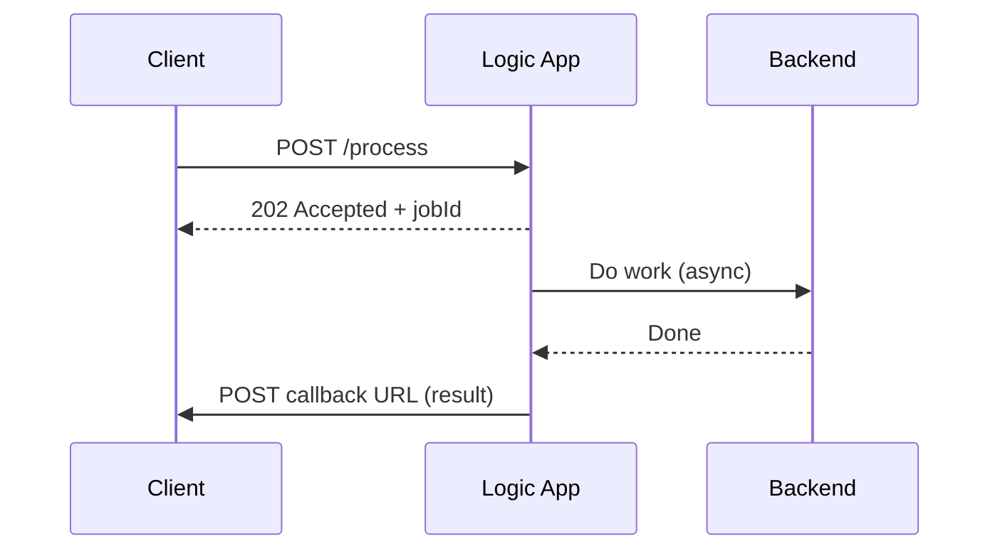

# Async Request-Reply with Azure Logic Apps

The **Asynchronous Request-Reply** pattern lets a client initiate work and receive an immediate acknowledgment, while the actual processing continues asynchronously. This avoids long-running HTTP calls, reduces timeouts, and improves resilience when downstream systems are slow.

In integration scenarios, Azure Logic Apps is a natural fit because it can:
- accept an inbound trigger (HTTP/Event Grid/Service Bus),
- orchestrate multi-step work,
- emit a callback event or store status for later retrieval.

---

## When to use

Use this pattern when:
- work can take longer than typical HTTP timeouts,
- you need to protect backends from burst traffic,
- you want to decouple request intake from processing (backpressure).

Avoid it when:
- the caller truly requires an immediate, complete response.

---

## Reference flow (HTTP start + status polling)

### Logic Apps mapping (typical design)
- **Trigger**: HTTP trigger to accept the request.
- **Immediate response**: return `202 Accepted` with a correlation/job ID.
- **Workflow**: long-running processing steps.
- **Status**: store state in a durable system (for example, a database, storage, or a workflow state store you control).

---

## Alternative flow (event callback)

This is common when the client can receive a callback webhook.

---

## Key considerations (workshop depth)

- **Correlation**: pick a single ID and propagate it across steps (gateway → logic app → downstream).
- **Idempotency**: retries happen; ensure the workflow can safely retry without duplicating effects.
- **Backpressure**: if downstream limits exist, consider ingesting via a queue/topic and processing at a controlled rate.
- **Timeouts**: design explicit timeouts and compensations instead of relying on default behavior.

---

## References

- Async Request-Reply pattern: https://learn.microsoft.com/en-us/azure/architecture/patterns/async-request-reply
- Cloud design patterns catalog: https://learn.microsoft.com/en-us/azure/architecture/patterns/
- Azure Logic Apps documentation: https://learn.microsoft.com/en-us/azure/logic-apps/
