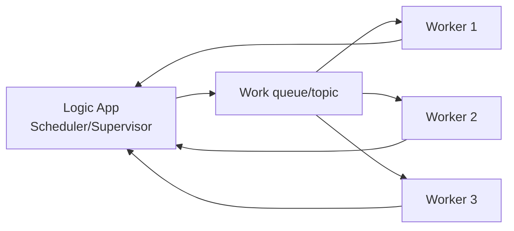
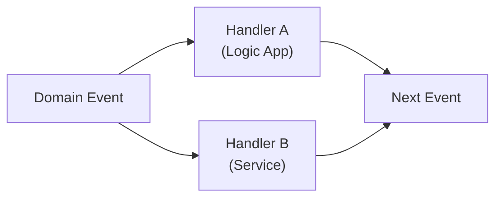
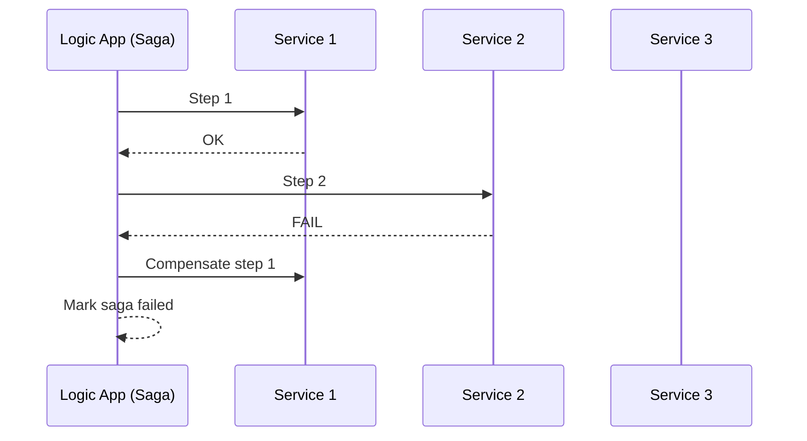

# Workflow Orchestration Patterns with Azure Logic Apps

Logic Apps is frequently used to coordinate integration steps across APIs, messaging systems, and SaaS connectors. The patterns below help you choose the right orchestration style and make failure behavior explicit.

---

## Pattern: Scheduler Agent Supervisor

### What it solves
Distributed workflows often need:
- a scheduler to decide *when* work runs,
- multiple workers/agents to do the work,
- supervision to detect failures and retry or recover.

### Logic Apps mapping
- A Logic App can act as the **scheduler/supervisor**.
- Workers are typically:
  - Azure Functions,
  - message consumers (Service Bus-triggered logic apps / functions),
  - HTTP-based services.

### Key considerations
- Prefer **message-based dispatch** to scale workers independently.
- Treat the supervisor as critical: add monitoring/alerts and clear retry rules.

---

## Pattern: Choreography (event-driven workflows)

### What it solves
Choreography avoids a central orchestrator by having services react to events.

### Logic Apps mapping
Logic Apps can participate as one of the event handlers, for example:
- subscribe to an event (Event Grid / Service Bus),
- execute a workflow step,
- emit a new event.

### Key considerations
- Choreography reduces central coupling but can make end-to-end flow harder to observe.
- You need consistent event contracts and versioning rules.

---

## Pattern: Saga (distributed transactions)

### What it solves
When a business process spans multiple services, a single ACID transaction is not available. Saga coordinates steps and uses compensations to unwind when needed.

### Logic Apps mapping
Logic Apps is commonly used as the Saga coordinator:
- each step calls a service (HTTP/connector) or sends a message,
- failure paths trigger compensating actions.

### Key considerations
- Compensations are not true rollbacks; design them carefully.
- Make each step idempotent and safe for retries.

---

## Workshop guidance: choosing orchestration style

- Prefer **choreography** when you have a well-defined event model and want loose coupling.
- Prefer **orchestration (Logic Apps)** when you need:
  - clear end-to-end visibility,
  - consistent error handling,
  - complex branching/approvals/human steps,
  - centralized governance.

---

## References

- Scheduler Agent Supervisor pattern: https://learn.microsoft.com/en-us/azure/architecture/patterns/scheduler-agent-supervisor
- Choreography pattern: https://learn.microsoft.com/en-us/azure/architecture/patterns/choreography
- Saga pattern: https://learn.microsoft.com/en-us/azure/architecture/patterns/saga
- Compensating Transaction pattern: https://learn.microsoft.com/en-us/azure/architecture/patterns/compensating-transaction
- Cloud design patterns catalog: https://learn.microsoft.com/en-us/azure/architecture/patterns/
- Azure Logic Apps documentation: https://learn.microsoft.com/en-us/azure/logic-apps/
