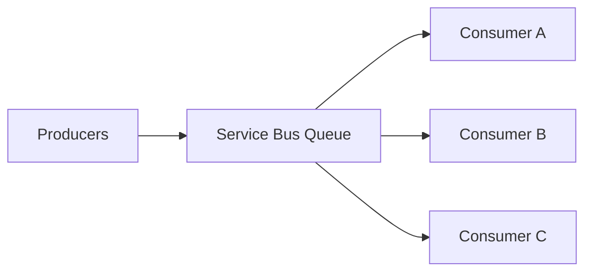

# Competing Consumers with Azure Service Bus

The **Competing Consumers** pattern uses multiple concurrent consumers reading from the same queue to increase throughput and improve resilience.

Azure Service Bus queues naturally support this pattern: multiple receiver instances can process messages in parallel.

---

## When to use

Use this pattern when:
- you need to scale message processing horizontally,
- processing time varies per message,
- you want to increase throughput without changing producers.

Avoid it when:
- strict, single-threaded ordering across all messages is required.

---

## Reference architecture

---

## Key considerations (L200–L300)

- **Ordering**: queues don’t guarantee a global order with many consumers; use sessions or partitioning strategies when ordering matters.
- **Idempotency**: consumers must handle duplicates (at-least-once delivery is common in distributed systems).
- **Lock duration / renewals**: long processing needs careful handling to avoid lock loss.
- **Backoff on failure**: don’t hot-loop failures; use retries with delays and DLQ.

---

## References

- Competing Consumers pattern: https://learn.microsoft.com/en-us/azure/architecture/patterns/competing-consumers
- Cloud design patterns catalog: https://learn.microsoft.com/en-us/azure/architecture/patterns/
- Azure Service Bus documentation: https://learn.microsoft.com/en-us/azure/service-bus-messaging/
