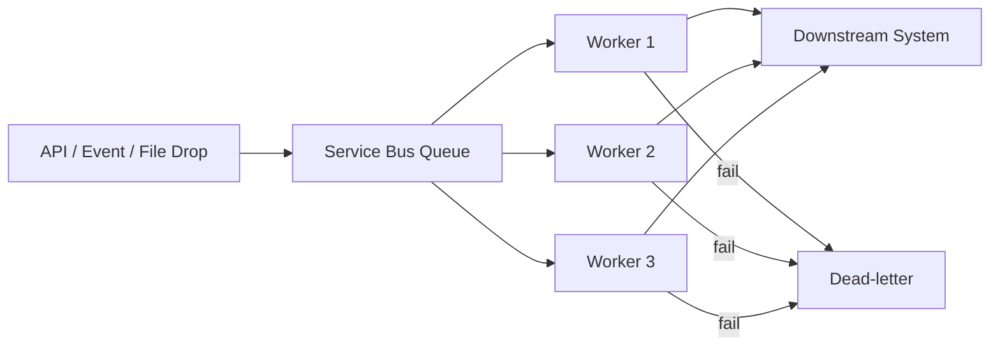

# Queue-Based Load Leveling with Azure Service Bus

The **Queue-Based Load Leveling** pattern uses a queue to smooth spikes in workload so downstream processors can operate at a controlled, sustainable rate.

Azure Service Bus queues/topics are a common implementation choice in integration architectures because they provide durable messaging, competing consumer scaling, and dead-letter handling.

---

## When to use

Use this pattern when:
- request volume is bursty (campaigns, batch imports, partner spikes),
- downstream systems have strict throughput limits,
- you want to protect a backend from sudden surges.

Avoid it when:
- work must be completed synchronously in a single request/response.

---

## Reference architecture

### Service Bus mapping
- Use a **queue** when each message goes to exactly one consumer.
- Use a **topic + subscriptions** when multiple independent consumers need the same event.
- Use **dead-lettering** to separate poison messages from healthy flow.

---

## Key considerations (L200–L300)

- **Message size limits**: keep payloads reasonable; store large blobs elsewhere and pass a reference (see Claim Check).
- **Throughput vs cost**: design your worker concurrency intentionally.
- **Retry strategy**:
  - handle transient failures with retries,
  - move poison messages to DLQ and alert.
- **Idempotency**: workers must tolerate redelivery.

---

## References

- Queue-Based Load Leveling pattern: https://learn.microsoft.com/en-us/azure/architecture/patterns/queue-based-load-leveling
- Cloud design patterns catalog: https://learn.microsoft.com/en-us/azure/architecture/patterns/
- Azure Service Bus documentation: https://learn.microsoft.com/en-us/azure/service-bus-messaging/
